# Background & Motivation

## The Shift to Distributed AI Systems

- Large Language Models (LLMs) have grown beyond the capacity of a single accelerator.
- Training and inference now fundamentally require multi-accelerator distributed systems.
- Distributed execution involves three concurrent activities: computation, memory access, and communication.
- Existing frameworks optimize these activities independently at different programming levels, leaving cluster potential untapped.

## The Programming Gap

- Algorithm development is typically done in Python.
- High-performance distributed optimization traditionally requires low-level CUDA/C++.
- This cross-language barrier forces cross-team collaboration and severely reduces development efficiency.
- Most users are proficient in only one domain, making co-optimization extremely difficult.

## The Need for Fine-Grained Overlapping

- As cluster sizes scale exponentially, communication overhead becomes the primary bottleneck.
- Overlapping computation with communication is vital for cost savings (e.g., saving millions of GPU hours).
- Fine-grained computation-communication overlapping exceeds the capabilities of existing compilers.
- Currently, this optimization is only accessible to a few teams with exceptional engineering resources.

## Limitations of Existing Compilers

- Compilers like Triton excel at single-chip code generation, matching expert-level cuBLAS/CUTLASS performance.
- However, compiler research has largely converged on single-device scenarios.
- Previous distributed compilers either target non-LLM workloads or propose proprietary DSLs instead of Python.
- Triton-distributed extends Triton to support native overlapping optimizations for distributed AI workloads entirely in Python.

# Design

## Compilation Stack

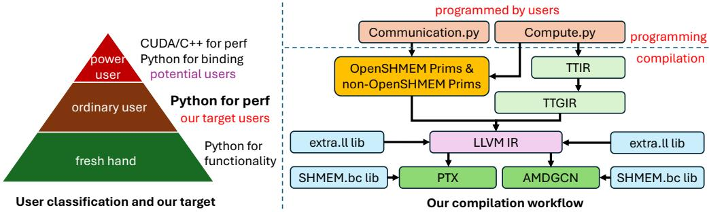{width=70% fig-align=center}

- Users program communication and computation separately in Python.
- Communication uses OpenSHMEM primitives; computation uses standard Triton.
- Both are lowered to LLVM IR (along with a bitcode library) and compiled to PTX or AMDGCN.
- Targets ordinary users familiar with Python, while offering power users a way to reduce development overhead.

## MPMD Programming Model

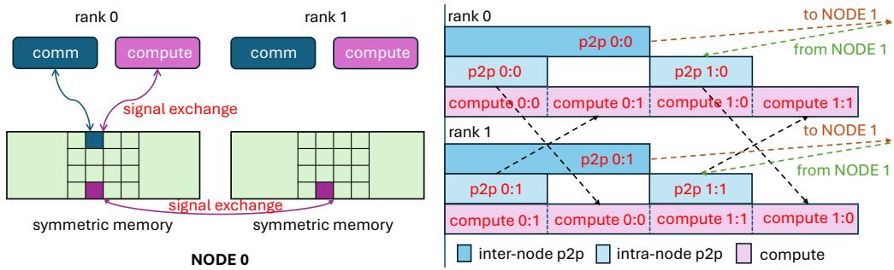{width=80% fig-align=center}

- Follows the Multiple Programs Multiple Data (MPMD) model.
- Communication and computation tasks run in parallel and cooperate to complete a global task.
- Built on three core concepts: Symmetric Memory, Signal Exchange, and Async-Tasks.

## Core Concept: Symmetric Memory

- Each rank allocates a memory buffer in the global scope with the exact same size.
- Each buffer has a separate address space (no Uniform Virtual Address space globally).
- Remote memory buffers cannot be accessed directly via standard pointers; specific primitives are required.

## Core Concept: Signal Exchange

- Ranks communicate and synchronize using signals residing in symmetric memory.
- Operations include setting, increasing, checking, and spin-locking on a given signal.
- Ensures consistent coordination between asynchronous tasks across different ranks.

## Core Concept: Async-Tasks

- Data transfer and computation are treated as asynchronous tasks running in parallel.
- Tasks are synchronized via signals.
- Mapped to hardware via multi-streaming (runtime task queues) or multi-threading (parallel hardware units).

## Communication Primitives

- **OpenSHMEM Primitives:** Standardized shared-memory operations (e.g., `putmem`, `getmem`, `barrier_all`).
- **Non-OpenSHMEM Primitives:** Custom primitives for compiler-based pipelining (e.g., `wait`, `consume_token`).
- Includes hardware-specific semantics like atomic operations and `multimem` load/store for low latency.

## Programming Example: AllGather GEMM

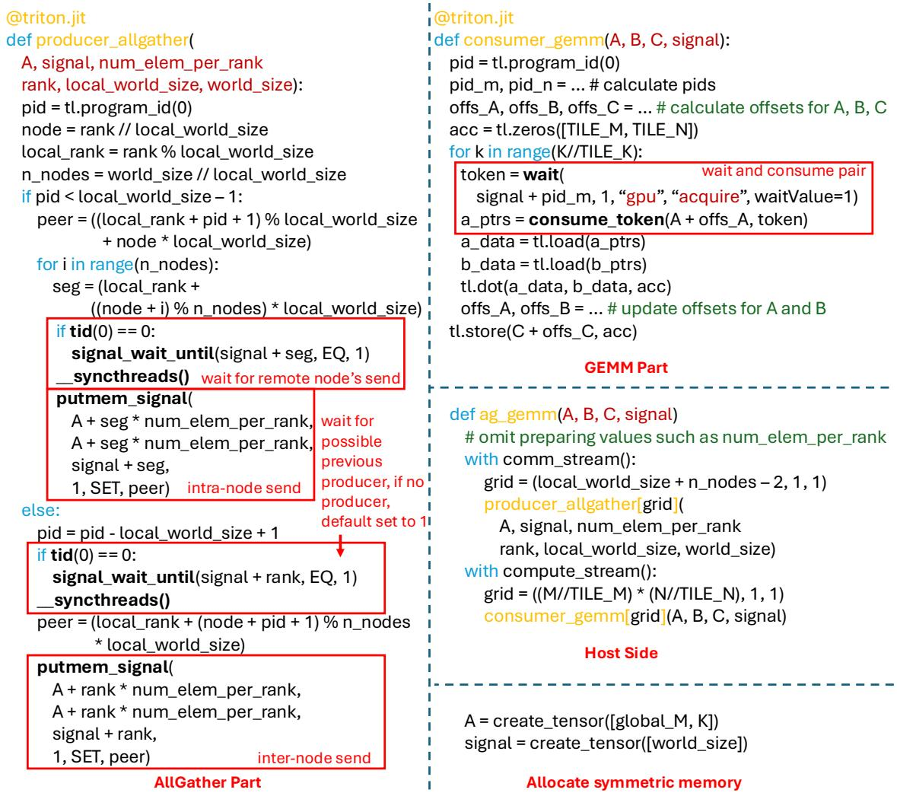{width=70% fig-align=center}

- **Communication:** Threadblocks are split between intra-node dispatch and inter-node data transfer.
- **Computation:** Reuses Triton's GEMM, adding `wait` and `consume_token` to create data dependencies.
- **Host Side:** Allocates symmetric memory and launches communication/computation on different streams.

## Intra-node Overlapping with Copy Engine

- Uses dedicated DMA (Copy Engine) for intra-node AllGather and ReduceScatter.
- Avoids consuming Streaming Multiprocessor (SM) resources during data transfer.
- Supports both push mode (fewer syncs, unordered) and pull mode (extra sync, ordered arrival).

## Inter-node Low-Latency AllGather

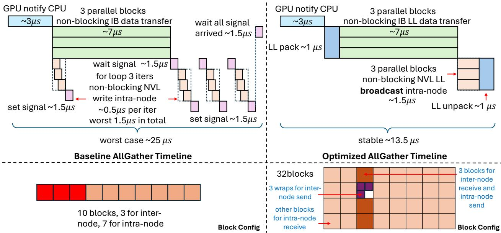{width=80% fig-align=center}

- Standard loop-based P2P transfers suffer from queuing skew, extending overall delay for small messages.
- Uses `multimem_st` for fast intra-node broadcast (~1.5µs).
- Uses Low-Latency (LL) protocol (8-byte atomic store/load with embedded flags) for inter-node transfer.
- Reduces worst-case latency from ~25µs to a stable ~13.5µs.

## Hardware-Specific Swizzling

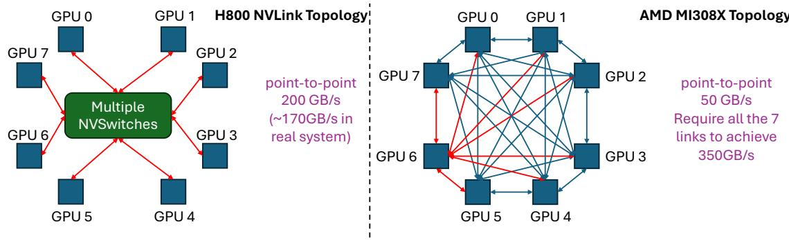{width=70% fig-align=center}

- **Swizzling:** Changing the order of computation tiles to align with communication data arrival.
- **Nvidia (NVLink):** 8 GPUs connected via NVSwitches (200 GB/s uni-directional).
- **AMD (MI308X):** Full-mesh topology (50 GB/s per link, requires using all 7 links to hit 350 GB/s peak).

## Swizzling Strategies

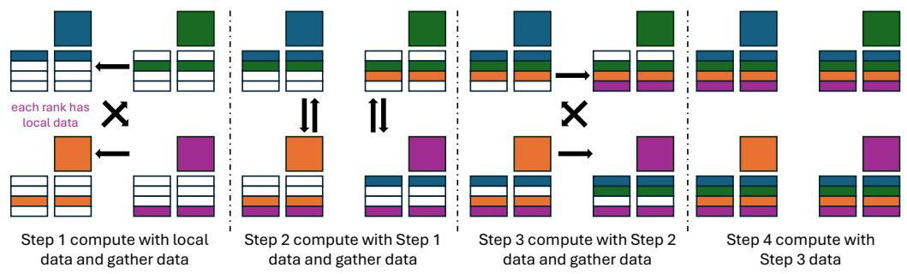{width=70% fig-align=center}

- **Nvidia Strategy:** Each rank gathers the next chunk of data from *one* other rank at a time, saturating the NVLink.

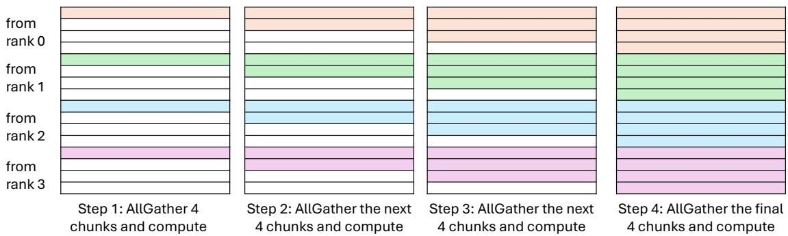{width=70% fig-align=center}

- **AMD Strategy:** Each rank gathers sub-chunks from *all* other ranks simultaneously to fully utilize the full-mesh bandwidth.

## Resource Partitioning

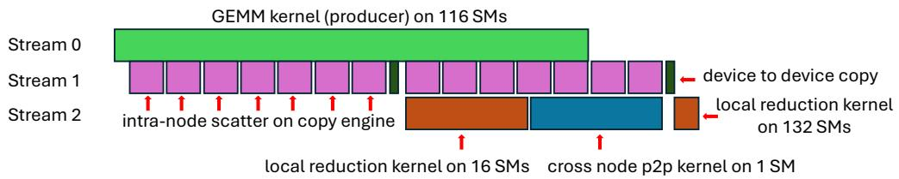{width=80% fig-align=center}

- Spatially maps computation and communication to different processing units to avoid long tails.
- Example (Inter-node GEMM ReduceScatter): GEMM uses 116 SMs, intra-node scatter uses Copy Engine.
- Cross-node P2P uses 1 SM, local reduction uses 16 SMs (first pass) and 132 SMs (second pass).

## Code Generation & Auto-Tuning

- Distributed autotuner wraps overlapping kernels (communication, computation, host-logic) into a target function.
- Iteratively profiles configurations while maintaining global synchronization conditions.
- Performs a global sync after tuning to select a globally unified best configuration.

# Evaluation

## Overall Speedup

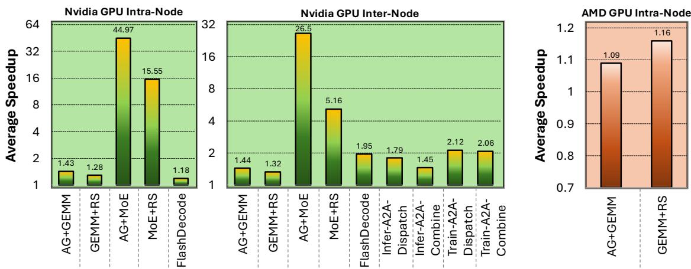{width=80% fig-align=center}

- Evaluated on Nvidia H800 (up to 64 GPUs) and AMD MI308X clusters.
- Achieves 1.09× to 44.97× speedup over PyTorch+NCCL/RCCL across a wide range of workloads.
- Python-generated code rivals or outperforms hand-optimized CUDA/C++ implementations.

## Intra-node AllGather GEMM

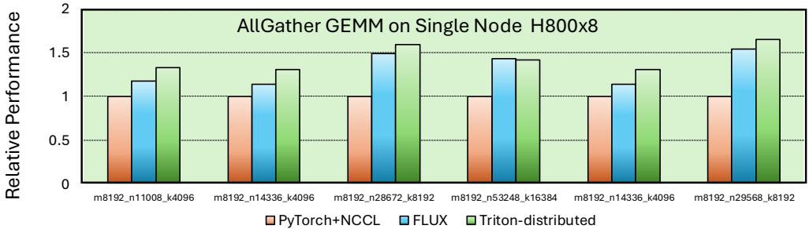{width=70% fig-align=center}

- Compared against PyTorch+NCCL (cuBLAS) and FLUX (CUTLASS).
- Averages 1.42× speedup over PyTorch+NCCL and 1.09× over FLUX.
- Gains stem from enhanced fine-grained overlapping, despite Triton's raw GEMM being ~95% of cuBLAS.

## Intra-node GEMM ReduceScatter

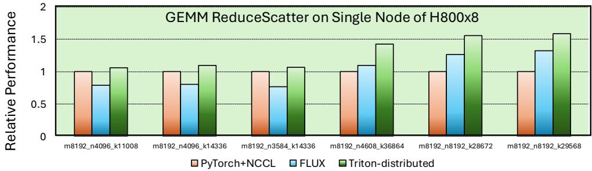{width=70% fig-align=center}

- Averages 1.28× speedup over PyTorch+NCCL and 1.30× over FLUX.
- Outperforms FLUX by using a separate stream for asynchronous scatter and local reduction, avoiding FLUX's global synchronization overhead.

## Inter-node Scaling

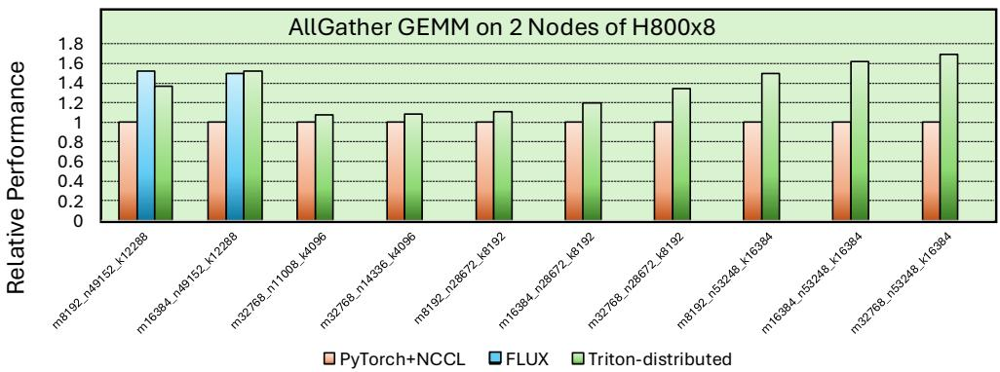{width=70% fig-align=center}

- Scaled to 2 nodes (16 H800 GPUs).
- Consistently exceeds PyTorch+NCCL with an average speedup of 1.33× for AllGather GEMM.
- Achieves 95.60% of the highly-optimized FLUX performance.

## Distributed Flash Decoding

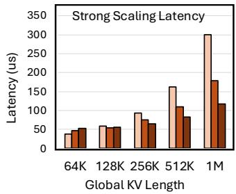{width=80% fig-align=center}

- Scales flash decoding across multiple devices (intra-node and inter-node).
- Excellent weak scaling: maintains 1.7 TB/s HBM bandwidth for 32 GPUs (32K KV cache length per GPU).
- Strong scaling shows latency benefits primarily for extremely long context lengths (e.g., 1M tokens).

## Low-Latency AllToAll

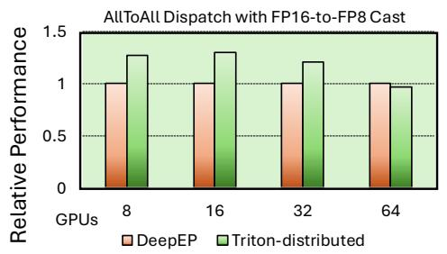{width=60% fig-align=center}

- Re-implemented DeepEP's complex CUDA AllToAll kernel with hundreds of lines of Python.
- Averages 1.18× speedup for AllToAll Dispatch and 1.44× for Combine (up to 64 GPUs).
- Omits DeepEP's complex memory queue management in favor of larger buffers, reducing overhead.

## AMD GPU Performance

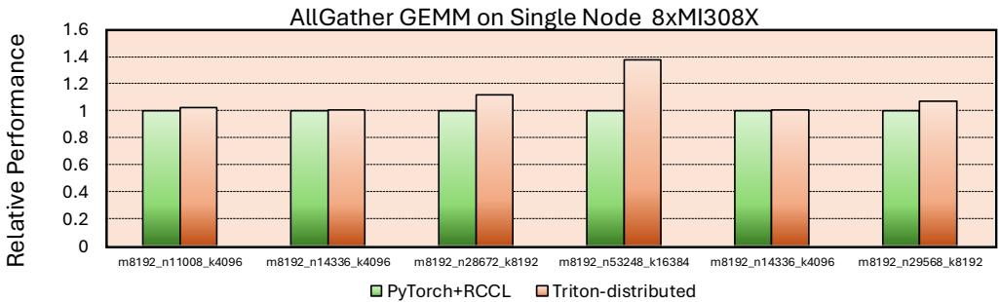{width=70% fig-align=center}

- Demonstrates compiler generality on AMD MI308X GPUs.
- Averages 1.09× speedup for AllGather GEMM over PyTorch+RCCL (rocBLAS).
- Averages 1.16× speedup for GEMM ReduceScatter, proving the overlapping strategy works across different hardware topologies.
