# Background & Motivation

## Serverless Inference & GPU Functions

- Model serving is latency-critical and computation-intensive.
- Early CPU-only FaaS functions fall short of meeting low-latency requirements.
- FaaS platforms now offer GPU functions, charging by invocation count and resource consumption.
- GPUs significantly improve inference efficiency (e.g., ResNet50 drops from hundreds of ms to <50ms).

## Inefficiency 1: Coarse-grained GPU Allocation

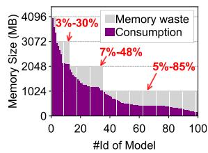{width=50% fig-align=center}

- Current FaaS platforms allocate GPUs coarsely (e.g., minimum 1GB of device memory).
- 78.1% of popular models require <4GB, and 66.4% require <1GB.
- Coarse allocation leads to massive resource over-provisioning (up to 85% waste for small models).
- Existing proprietary vGPU solutions lack the flexibility needed for dynamic serverless environments.

## Inefficiency 2: Keep-alive Cost

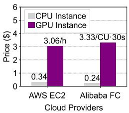{width=50% fig-align=center}

- Cold starts for GPU functions take seconds due to model, driver, and framework initialization.
- FaaS providers cache instances (keep-alive) for up to 15 minutes to mitigate cold starts.
- GPUs are ~14x more expensive than CPUs in the cloud.
- Caching idle GPU instances leads to 10x higher cloud costs and poor resource utilization during workload bursts.

## Inefficiency 3: Insufficient Over-selling

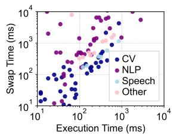{width=50% fig-align=center}

- Prior systems use model swapping to reclaim idle GPUs, but rely on proxy-based control planes.
- Two-layer GPU management introduces overhead and performance uncertainty.
- Model swapping incurs non-negligible latency (e.g., ~1s for 1GB).
- Simple heuristic scheduling ignores function behavior, causing either low utilization or SLO violations.

## Opportunity for Aggressive Sharing

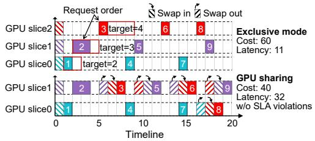{width=70% fig-align=center}

- Cloud users have diverse latency requirements (e.g., strict interactive vs. lenient batch processing).
- Users opting for discounted idle billing are willing to accept slight latency increases.
- Carefully reordering request execution can reduce GPU usage by ~30% without violating latency SLOs.

## Key Insights

- **Fine-grained GPU allocation:** Time-slicing with vGPU minimizes over-provisioning waste.
- **Resource decoupling:** Decoupling GPUs from function memory enables flexible recycling and sharing.
- **Efficient GPU overselling:** Co-designing vGPU allocation and SLO-aware scheduling balances cost and performance.

# Design

## gShare System Architecture

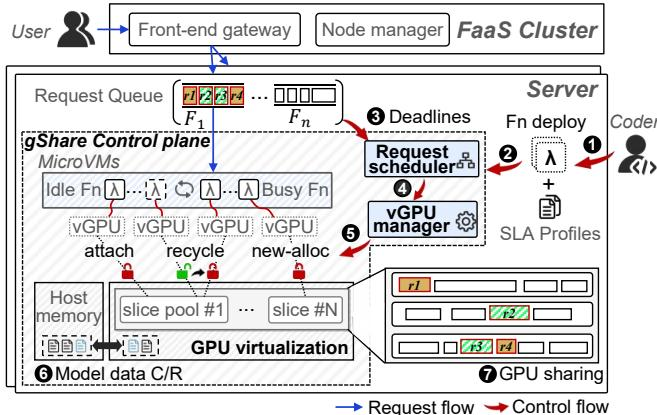{width=80% fig-align=center}

- A server-level GPU overselling policy that minimizes GPU allocation while meeting latency SLOs.
- Divides physical GPUs into vGPU slices (e.g., 128MB memory, 10% compute quota).
- Dynamically maps vGPU instances to user functions based on workload changes.
- Operates as a back-end module on each server, transparent to the cluster-level load balancer.

## VM-passthrough GPU Virtualization

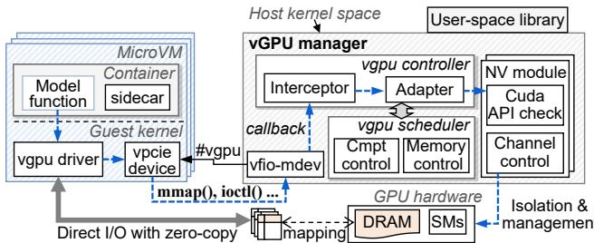{width=80% fig-align=center}

- Uses kernel-space interception to virtualize GPUs, ensuring compatibility with custom VM images.
- **vGPU Manager:** Runs in the host OS, exposing vGPU driver APIs to guest microVMs.
- Supports fine-grained creation of GPU functions in units of 128MB.
- Exposes user-space libraries for seamless integration with orchestration frameworks like Kubernetes.

## Direct I/O and vGPU Scheduling

- Leverages `vfio-mdev` for direct I/O access between hardware and virtual machines.
- Bypasses virtualization overhead by allowing guest processes to access device memory via standard system calls.
- **vGPU Scheduler:** Enforces memory limits and temporal sharing of SM cores.
- Uses round-robin scheduling with non-preemptive time slices (e.g., 20ms) to execute kernels in FCFS order.

## Function Memory Management

- Recycling idle vGPU instances accommodates more tenant functions on the same hardware.
- Requires efficient mechanisms for vGPU hot-plugging and model swapping.
- Standard PCIe hot-plugging takes ~0.7s, which is too slow for dynamic reallocation.

## vGPU Hot-Plugging

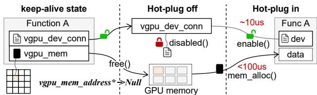{width=70% fig-align=center}

- Implements a "pseudo offloading" strategy to mitigate hot-plugging overhead.
- When unloading, only the hardware resource is released; the vGPU connection remains active but disabled.
- Upon resuming, the vGPU manager simply reactivates the GPU slice without instantiating a new device.
- Reduces vGPU hot-plugging time to less than 1ms.

## Checkpoint & Restore (C/R)

- Avoids redundant model initialization for keep-alive functions.
- Uses CUDA checkpointing to create model snapshots directly within the microVM.
- Extends microVM sidecars to support direct model data management.
- Stores snapshots in a shared host memory pool instead of disk, enabling fast in-memory recovery.

## Fast Model Swapping

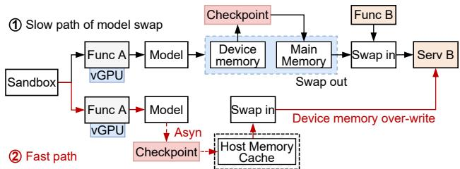{width=70% fig-align=center}

- Traditional reallocation requires a slow swap-out and swap-in pair.
- Introduces a GPU memory "overwrite" mechanism based on snapshot caching.
- If a model is already cached in host memory, the swap-out operation is skipped entirely.
- Only a swap-in operation is performed, significantly reducing reallocation latency.

## SLO-aware Request Scheduling Formulation

- Modeled as an online bin packing problem with per-request deadline constraints.
- **Objective:** Minimize the total GPU resource cost on active function instances.
- **Constraints:** Requests cannot execute before arrival, strict execution order, no overlapping execution, and latency targets must be met.
- NP-hard problem requiring a fast, practical online algorithm.

## Dual-Queue Lazy Scheduling Algorithm

- Maintains incoming requests in a `shareQueue`, prioritized by deadline slack.
- Classifies requests: high-risk requests (likely to violate SLO) are moved to a `cacheQueue` for exclusive execution.
- **Lazy Scheduling:** Requests in `shareQueue` are only scheduled when their deadline is near (slack = 0).
- Allows reprioritization and maximizes the reuse of already active GPU slices to reduce idle waste.

# Evaluation

## Experimental Setup

- **Testbed:** 20 physical servers, 64 NVIDIA A100 GPUs (40GB).
- **Workloads:** Real-world traces from production clusters (low, medium, and high concurrency).
- **Latency Target:** Default set to 1.5x the 90th percentile (p90) execution time.
- **Baselines:** Keepalive (AWS Lambda style), FaasCache, FaaSwap (state-of-the-art), NoCache, and FIFO.

## Overall Performance & Efficiency

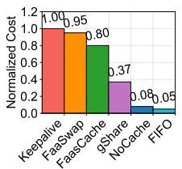{width=50% fig-align=center}

- gShare reduces GPU usage by 43%–63% compared to the Keepalive baseline.
- Maintains function performance comparable to the baseline.
- Outperforms FaaSwap by reducing latency violations by up to 6x.
- Avoids the extreme scheduling behaviors of NoCache (frequent swaps) and FIFO (early scheduling waste).

## Workload Agnosticism

- Delivers consistent performance improvements across diverse workload scenarios.
- Adapts to variations in tenant count, request arrival intervals, and function concurrency.
- Server-level scheduling uses function profiling data to dynamically adapt to various ML scenarios.

## Request Latency Distribution

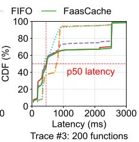{width=60% fig-align=center}

- Lazy scheduling slightly increases request waiting time but has negligible impact on p50 latency.
- Performance gap narrows progressively from 60% at p90 to just 15% at p95 and p99 latency.
- Severe performance degradation is rare and mostly limited to initialization of single-invocation functions.
- Adding 40% redundancy to predicted execution times effectively mitigates prediction errors.

## Pareto Optimality

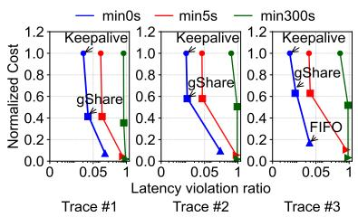{width=70% fig-align=center}

- Achieves Pareto optimality between resource cost and function performance across 20 different configurations.
- Strikes a favorable balance, whereas Keepalive incurs high costs and FIFO causes numerous SLO violations.

## Sensitivity Analysis

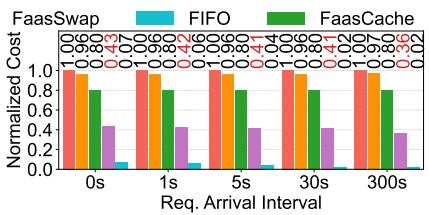{width=60% fig-align=center}

- Performs exceptionally well under sparse workloads with lenient latency targets.
- Reduces resource usage by ~60% vs. Keepalive and ~50% vs. FaaSwap under sparse conditions.
- Model swapping time remains the primary cause of latency target violations across all methods.
- gShare's scheduling wait time contributes <1% to SLO violations.

## Virtualization Overhead & Resource Isolation

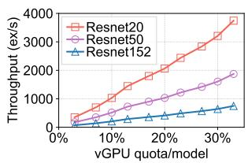{width=80% fig-align=center}

- **Overhead:** Negligible performance degradation compared to full physical GPUs (zero-copy memory, native channel scheduling).
- **Isolation:** Model throughput scales linearly with the allocated vGPU quota.
- Performance of each vGPU function remains stable even when processing concurrent requests from different tenants.

## Cost Benefit Analysis

- Estimated using AWS EC2 pricing (p4d.24xlarge at $2.74/hour per GPU).
- Reduces GPU resource usage by up to 40% even in worst-case scenarios.
- For a typical 200-server FaaS cluster, gShare saves approximately $330,000 annually.
- Benefits both cloud providers (reduced procurement) and users (discounted idle billing).

## Performance Roofline

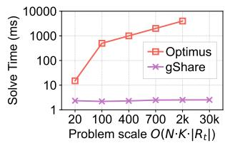{width=80% fig-align=center}

- Compared against the optimal MINLP solution solved by Lingo.
- gShare's online scheduling algorithm achieves 75% of the optimal cost-efficiency.
- Decision-making speed is 10x–100x faster than the solver, making it highly practical for production systems.
